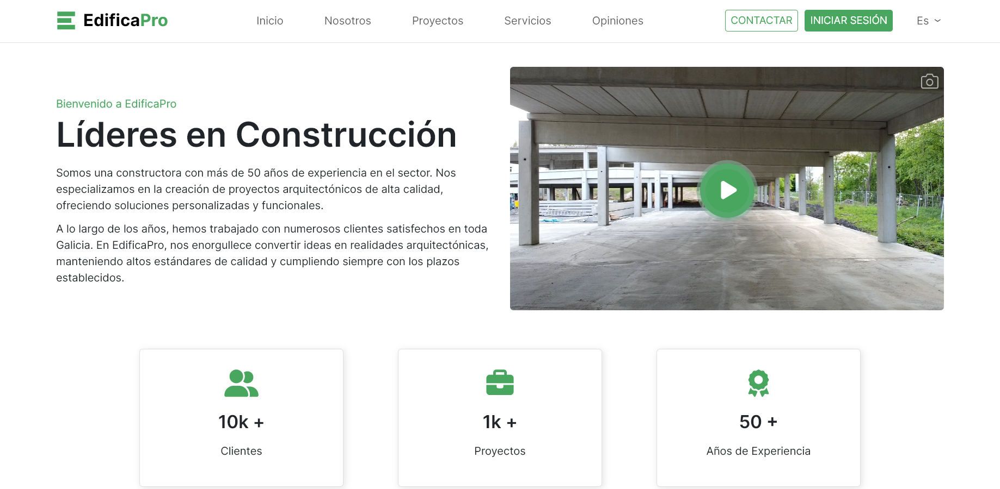
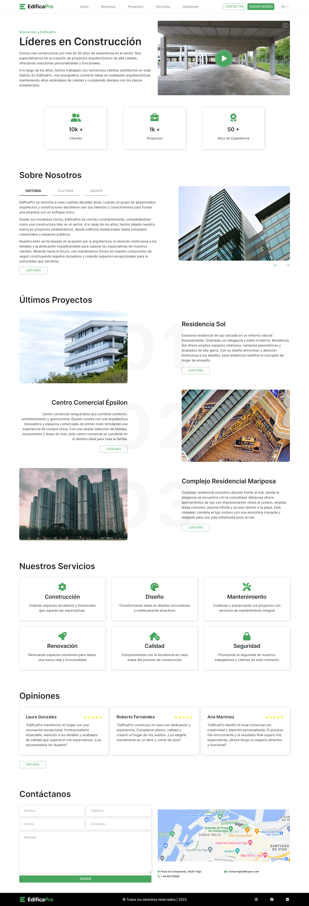
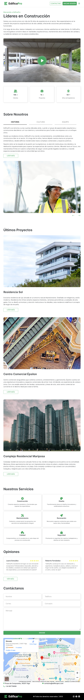
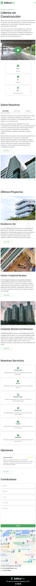

    <h1>
        
        <a href="https://spectacular-torte-2fa425.netlify.app/">EdificaPro</a>
    </h1>
    <h4>
        <b>Project created from a design idea to practice HTML, CSS and JS</b>
    </h4>
    <h4>
        <a href="#tech-stack">Stack</a>
        •
        <a href="#motivation">Motivation</a>
        •
        <a href="#detailed-implementation">Implementation</a>
        •
        <a href="#credits">Credits</a>
    </h4>
    <h4> <!-- tech stack images (https://github.com/Ileriayo/markdown-badges)  -->
        
        
        
        
    </h4>

### 

This project was based on a design made by [Evgenrec](https://www.youtube.com/@evgenrec5798). I adapted the content and images although the design is very similar. The main project is a landing page made only with HTML, CSS and Javascript. Moreover, I used[Bootstrap](https://getbootstrap.com/docs/5.3/getting-started/introduction/), which simplifies much more the styles applied to the page. This project is a good way to practice frontend skills and responsiveness on sites. 

If you want to know more about the styles and stack I used, keep reading!

# Table of contents
- [Table of contents](#table-of-contents)
- [Tech stack](#tech-stack)
  - [Libraries used](#libraries-used)
- [Motivation](#motivation)
- [Detailed Implementation](#detailed-implementation)
  - [Design](#design)
    - [Colors](#colors)
    - [Fonts](#fonts)
  - [HTML](#html)
    - [Highlights:](#highlights)
  - [CSS](#css)
    - [Highlights:](#highlights-1)
  - [JS](#js)
  - [Responsiveness](#responsiveness)
- [Contribute](#contribute)
- [Credits](#credits)

# Tech stack
This project follows a basic web development stack:

* 
* 
* 
* 
  
## Libraries used

No libraries were used in this project, although the styles were applied mostly by using Bootstrap, which is a frontend framework that makes easier to apply different styles and prebuilt components. Further than just applying those styles, the use of this framework allowed me to read much documentation about Bootstrap and understand how to apply it to my project. This made me realise that I can read any documentation of other libraries and frameworks and use them in other projects.

# Motivation

The main motivation of this project is to make a good and complete frontend page that allows me to show my skills of HTML CSS and Javascript. This could be a real project for a constructor company or any ohter company, so it motivates me to know that I can work in a project like this one and make the frontend part with a good design, good practices and adapted to any device.

# Detailed Implementation

As mentioned, this project is fully responsive, following different designs according to the device. Moreover, different styles were applied according to the sections of the page. In the following points, the elements used are detailed.

## Design

For the styles applied, different colors were used for the text, buttons and other elements. Only one font was used. Moreover, by using Bootstrap, some prebuild components were applied.

### Colors
Colors that were used in this project:
*  `#49A65F` &rarr; buttons and icons
*  `#ffffff` &rarr; background
*  `#000000` &rarr; text
  
### Fonts
* [Inter](https://fonts.google.com/specimen/Inter) &rarr; 

## HTML

The markup follows a semantic structure by using tags like `main`, `header` and `footer`. Moreover, `section` tags were used and different containers to apply correctly Bootstrap. Note that in this project Bootstrap was implemented by inserting a `link` tag in the `head` for the CSS classes, and a `script` tag to import the Javascript content.

### Highlights:
* Use of semantic tags
* Importation of Bootstrap

## CSS

As mentioned previously, CSS was applied with Bootstrap. For this to be achieved, different classnames are applied to each HTML element so that the corresponding style is applied. For example, some containers have a flexbox style applied by using those classes. 

Moreover, this page also have some prebuilt components of Bootstrap, which are the menu button when the size become smaller, so that the navigation appears on click. A carousel is also used for different images.

### Highlights:
* Use of Bootstrap classes
* Use of Bootstrap components

## JS

Javascript was applied to start and stop the video on the main section when a click is detected. On the other hand, JS was also used to detect the clicks on different subsections on the about section. This is basic DOM manipulation and htere are no highlights about it.

## Responsiveness

This landing page is completely responsive, and for this to be achieved, small modifications were made for different screen sizes, going from desktop to tablet and mobile devices. 

     
     
    

# Contribute
If you liked my project and ideas or you think I could improve it, feel free to support my work or give me any advice by leaving me a message!

# Credits

